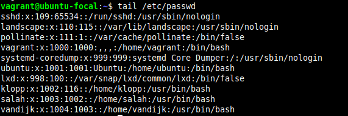
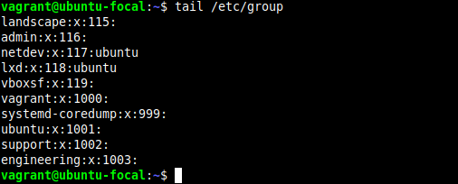
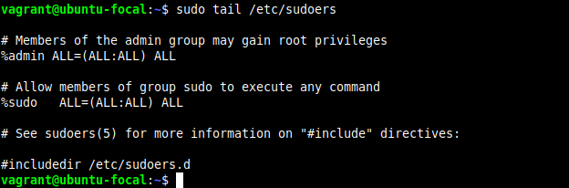
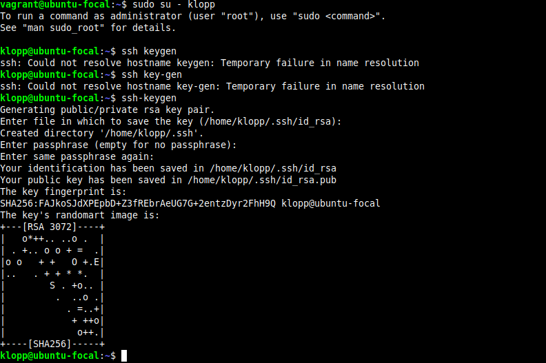

# Altschool-Cloud Assignment

## Exercise 3

### -Task: Create 3 groups – admin, support & engineering and add the admin group to sudoers. 
###        Create a user in each of the groups. 
###        Generate SSH keys for the user in the admin group

### Instruction

- Submit the contents of /etc/passwd, /etc/group, /etc/sudoers

---

```
This an image of my /etc/passwd
```




---

```
This an image of my /etc/group
```



---

```
This an image of my /etc/sudoers
```



---

```
This an image of my the keg-gen of my admin
```

