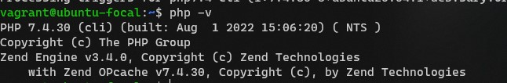

# Altschool-Cloud Assignment

## Exercise 1

### Task: Install PHP 7.4 on your local linux machine using the ppa:ondrej/php package repo.

### Instruction

- Learn how to use the add-apt-repository command
- Submit the content of /etc/apt/sources.list and the output of php -v command.

---

```
This is the output of the php -v command
```



```
This is the content of /etc/apt/sources.list
```

[/etc/apt/sources.list](./files/source.txt)

```
This is the content of /etc/apt/sources.list.d
```

[/etc/apt/sources.list.d](./files/source-d.txt)
