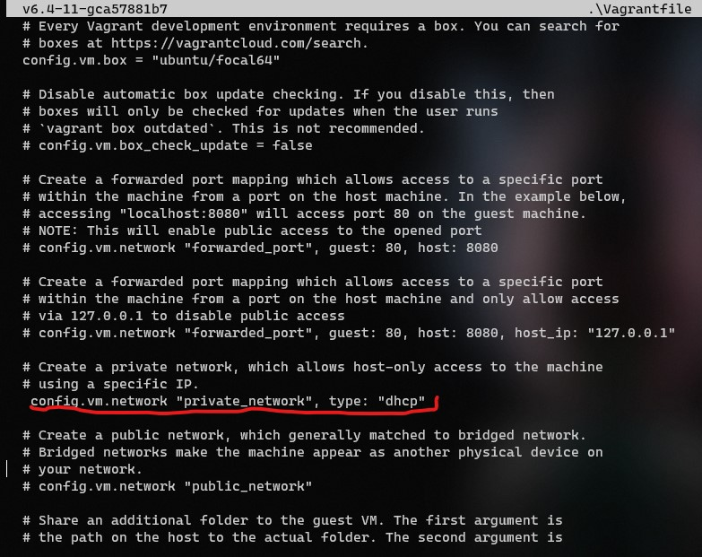
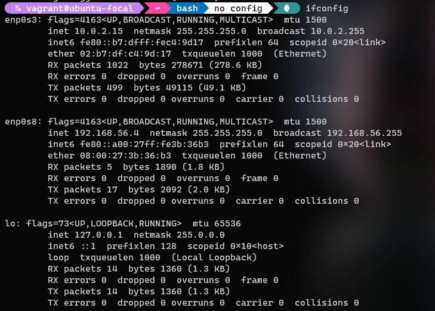

# Altschool-Cloud Assignment

## Exercise 1

### Task: Setup Ubuntu 20.04 LTS on your local machine using Vagrant

### Instruction

- Customize your Vagrantfile as necessary with private_network set to dhcp
- Once the machine is up, run ifconfig and share the output in your submission along with your Vagrantfile in a folder   for this exercise.

---

```
This an image of my VagrantFile
```



```
==This is the output of the *ifconfig* command==
```


