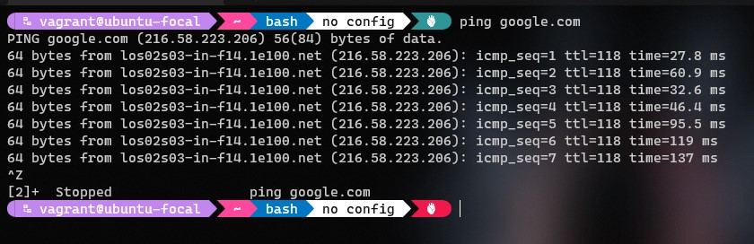
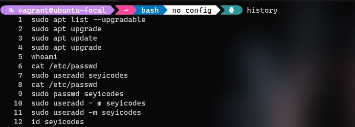
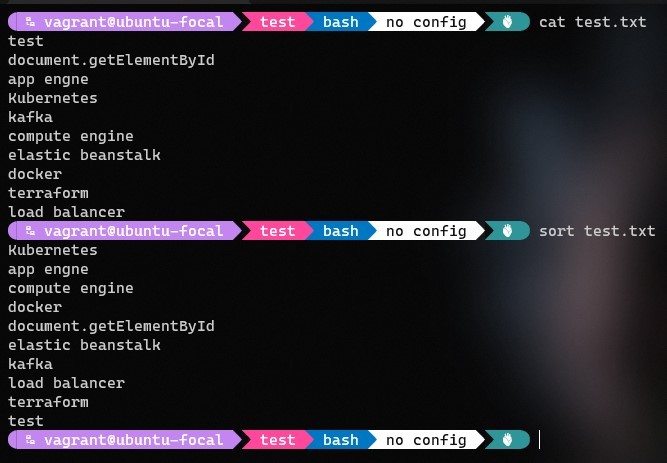
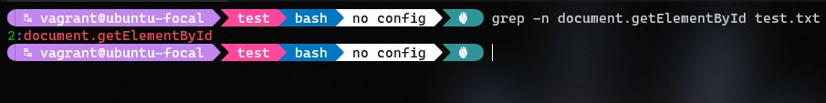
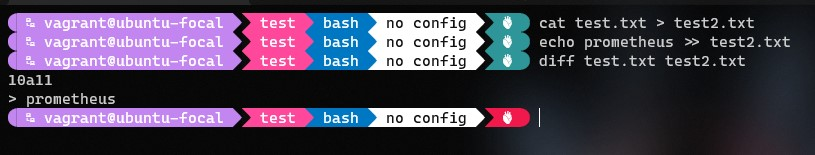
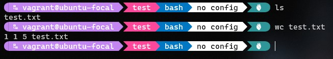
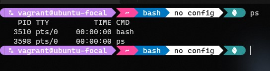
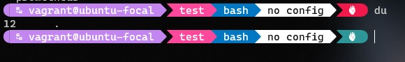
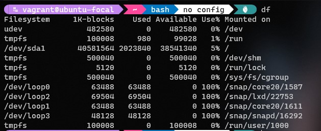

# Altschool-Cloud Assignment

## Exercise 2

### Task: Research online for 10 more linux commands aside the ones already mentioned in this module. Submit using your altschool-cloud-exercises project, explaining what each command is used for with examples of how to use each and example screenshots of using each of them.

### Instruction

- Submit your work in a folder for this exercise in your altschool-cloud-exercises project. You will need to learn how to embed images in markdown files.

---

```
PING
The ping command pings a specific network host, on the local network or on the Internet.
```




```
HISTORY
This shows the history of commands run on the terminal
```




```
SORT
The sort command helps you sort lists by alphabetically,and it is case sensitive by default.
```




```
GREP
You can use grep to search in files, or combine it with pipes to filter the output of another command.
```




```
DIFF
The diff command will process files which contain almost the same information and will tell you what's the difference.
```




```
WC
The wc command gives us useful information about a file or input it receives via pipes
```




```
PS
You can inspect them all running  processes using the ps command
```




```
DU
The du command will calculate the size of a directory as a whole
```




```
DF
The df command is used to get disk usage information
```




```
TYPE
The type command can help figure out what type a command is.
```


