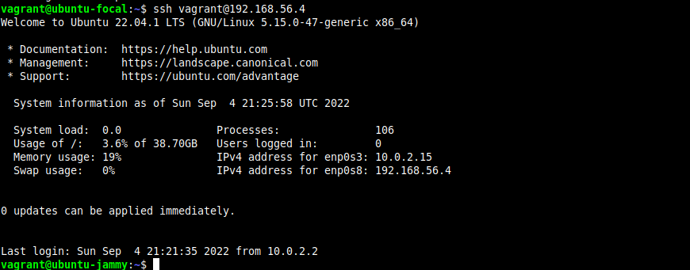

# Altschool-Cloud Assignment

## Bonus Exercise 2

### Task: SSH from one mahine to another using ssh keys

### Instruction

- Submit the output

---

```
This an image of my ssh from one amchine to another
```


