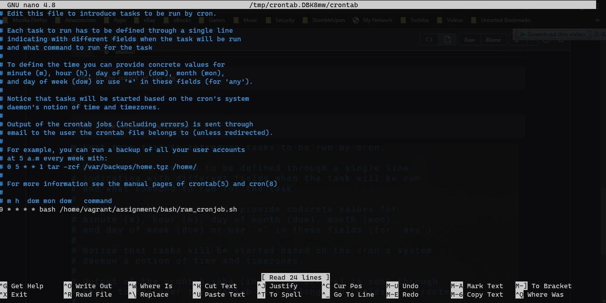

# Altschool-Cloud Assignment

## Exercise 7

### Task: Create a bash script to run at every hour, saving system memory (RAM) usage to a specified file and at midnight it sends the content of the file to a specified email address, then starts over for the new day.

### Instruction: Submit the content of your script, cronjob and a sample of the email sent, all in the folder for this exercise.

---

```
This is the bash script
```
./files/Gmail_Exercise _7_Ram_Usage.pdf
[bashscript.sh](./files/_home_vagrant_altschool_bash_ram_cronjob.sh)

```
This is a sample of the email sent.

[Email](./files/Gmail%20_Exercise%20_7_Ram_Usage.pdf)

```
This is the output of the log 
```

[log](./files/_home_vagrant_altschool_assignment_ram_cronjob.log)

```
This is the output of the cronjob 
```


