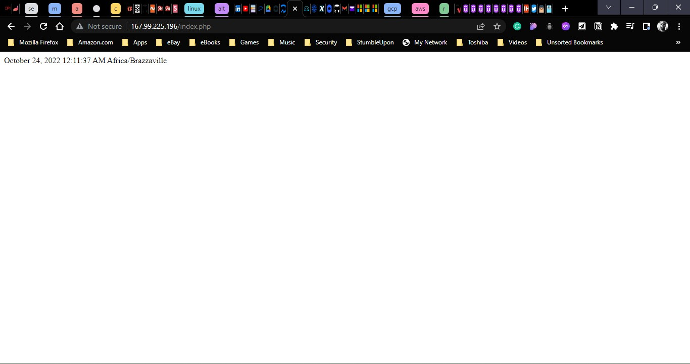

# Altschool-Cloud Assignment

## Exercise 8

### Task:

        - Create an Ansible Playbook to setup a server with Apache
        - The server should be set to the Africa/Lagos Timezone
        - Host an index.php file with the   following content, as the main file on the server:

```php
<?php
echo date("F d, Y h:i:s A e", time());
?>
```

### Instruction

- Submit the Ansible playbook, the output of systemctl status apache2 after deploying the playbook and a screenshot of the rendered page


---

```
This a screenshot of the rendered page
```



```
This is a screenshot of the output of the systemctl status apache2 command
```


```
This is my Ansible playbook
```

[Ansible Playbook](./files/_home_vagrant_altschool_ansible_seyiSetup.yml)
