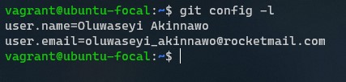
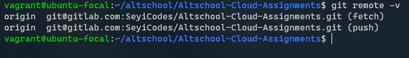
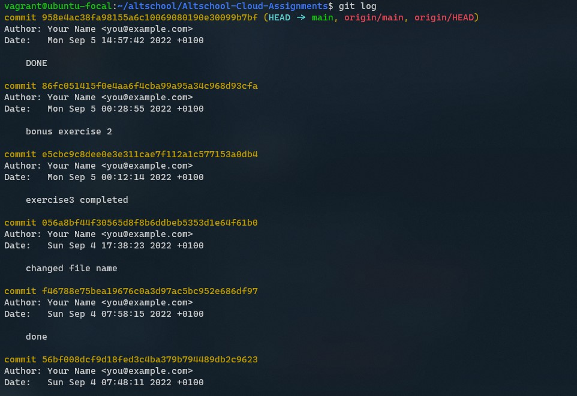

# Altschool-Cloud Assignment

## Exercise 5

### Task: You already have Github account, aso setup a GitLab account if you don’t have one already
### - You already have a altschool-cloud-exercises project, clone the project to your local system
### - Setup your name and email in Git’s global config

### Instruction: Submit the output of

- git config -l
- git remote -v
- git log

---

```
This the output of the git config -l command
```



```
This is the output of the git remote -v command
```



```
This is the output of the git log command
```


